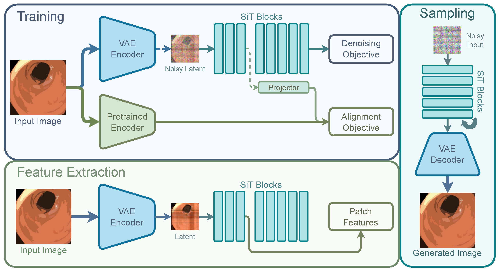

## [ECCV DCA-MI 2026] - REVEAL

<p align="center">
  
</p>

The official implementation of [**Representation-driven Endoscopic Visual
Embedding Alignment for Latent Generation**]().

**[Francisco Caetano](https://caetas.github.io)<sup>1</sup>, [Tim J.M. Jaspers](https://scholar.google.com/citations?user=nwfiV2wAAAAJ&hl=en&oi=ao)<sup>1</sup>, [Haiko Middeljans](https://scholar.google.com/citations?user=c4t8jsQAAAAJ&hl=en&oi=ao)<sup>1</sup>, [Martijn R. Jong](https://scholar.google.com/citations?user=QRNrL-oAAAAJ&hl=en&oi=ao)<sup>2</sup>, [Rixta A.H. van Eijck van Heslinga](https://pure.amsterdamumc.nl/en/persons/rixta-van-eijck-van-heslinga/)<sup>2</sup>, [Floor Slooter](https://amsterdamumc.org/en/research/researchers/floor-slooter.htm)<sup>2</sup>, [Albert Jeroen de Groof](https://scholar.google.com/citations?user=nT3VfE4AAAAJ&hl=en&oi=ao)<sup>2</sup>, [Jacques J. Bergman](https://scholar.google.com/citations?user=4SFBE0IAAAAJ&hl=en&oi=ao)<sup>2</sup>, [Peter H.N. de With](https://www.tue.nl/en/research/researchers/peter-de-with)<sup>1</sup>, [Fons van der Sommen](https://scholar.google.com/citations?user=qFiLkCAAAAAJ&hl=en&oi=ao)<sup>1</sup>**

<sup>1</sup> Eindhoven University of Technology, 
<sup>2</sup> Amsterdam University Medical Centers

## What is REVEAL?

Developing foundation generative models for endoscopy is limited by the gap between natural and clinical images and the computational cost of training large Diffusion Transformers. Although representation alignment has improved efficiency in general computer vision, its role within the highly specialized endoscopic image space remains unclear. We introduce REVEAL (Representation-driven Endoscopic Visual Embedding Alignment), a foundation generative model trained on GastroNet-5M, a multicenter corpus of 5 million endoscopic frames. Instead of depending on out-of-domain priors, REVEAL employs encoders pretrained directly on the endoscopic distribution to align diffusion latents with domain-specific visual features, preserving fine textures and intricate anatomical structures. Beyond image generation, REVEAL also serves as a strong feature extractor: on the POLAR and Barrett’s Esophagus benchmarks, its internal representations show greater semantic richness than current specialized endoscopic models. REVEAL produces high-fidelity images and maintains robust structural coherence in latent-space edits such as inpainting and outpainting. This high-capacity backbone lowers the computational threshold for building specialized clinical tools, offering an open, versatile foundation for future intelligent gastroenterology systems.

## Repository Structure

- `src/dit/`: SiT and iREPA training/sampling entrypoints
- `src/jit/`: JiT training/sampling entrypoints
- `data/raw/GastroNet-5M/`: dataset location expected by dataloaders
- `models/iREPA/`: iREPA checkpoints (includes one example checkpoint)
- `models/pretrained_models/`: pretrained encoder/model checkpoints

## Setup

### Prerequisites

- `python>=3.12` (see `pyproject.toml`)
- `uv`
- `git`
- `NVIDIA Drivers`(mandatory) and `CUDA >= 12.8` (mandatory if Docker/Apptainer is not used)
- `Weights & Biases` account

### Installation (uv)

```bash
git clone git@github.com:caetas/REVEAL.git
cd reveal
uv sync --python 3.12
```

#### Environment Variables

This project reads paths from `.env` (already present in the repository template).

- dataset root: `DIR_DATA_RAW`
- model root: `DIR_MODELS`

If you use Weights & Biases, create a `.secrets` file with:

```bash
WANDB_API_KEY=<your-wandb-api-key>
```
### Installation (Docker/Apptainer)

Convert the Docker Image to a `.sif` file:

    apptainer pull reveal.sif docker://ocaetas/reveal

Then run the script [`job_apptainer.sh`](scripts/job_apptainer.sh) that will execute [`main.sh`](scripts/main.sh):
    
    cd scripts
    bash job_apptainer.sh

To access the shell, please run:

    apptainer shell --nv --env-file .env --bind $(pwd)/:/app/ reveal.sif

**Add the flag `--nvccli` if you are using WSL.**

**Note: Edit the [`main.sh`](scripts/main.sh) script if you want to train a different model.**

## Training

### Dataset Download

The full dataset can be downloaded [`here`](https://cortex.thetavision.nl/dataset-provider/listing/1/).

### Pretrained Encoders

You need to [request access](https://ai.meta.com/resources/models-and-libraries/dinov3-downloads/) to access the DINOv3 pretrained encoders.

The GastroNet-5M pretrained encoders can be downloaded [`here`](https://cortex.thetavision.nl/dataset-provider/listing/2/).

### iREPA training (`src/dit/iREPA.py`)

```bash
cd src/dit
uv run accelerate launch --mixed_precision=bf16 --multi_gpu --num_processes=4 iREPA.py \
  --train \
  --dataset gastronet \
  --img_size 256 \
  --model SiT-L/2 \
  --class_num 0 \
  --batch_size 128 \
  --n_epochs 63 \
  --sample_and_save_freq 7 \
  --ema_decay 0.9996 \
  --num_workers 64 \
  --lr 2e-4 \
  --final_lr 5e-5 \
  --vae SD2 \
  --enc_type dinov3-vit-b16 \
  --snapshot 1 \
  --enc_ckpt_path ./../../models/pretrained_models/gastro_231k.pth \
  --gradient_accumulation_steps 2 \
  --full
```

## Inference

### 1) Download pretrained weights

The folder containing the pretrained weights of the models used in the paper can be downloaded [`here`](https://huggingface.co/ocaetas/REVEAL).

### 2) Run sampling with iREPA

```bash
cd src/dit
uv run accelerate launch --mixed_precision=bf16 iREPA.py \
  --sample \
  --img_size 256 \
  --model SiT-L/2 \
  --class_num 0 \
  --vae SD2 \
  --enc_type dinov3-vit-b16 \
  --checkpoint ../../models/iREPA/SD2_SiT-L_2_gastronet.pt \
  --num_samples 16
```

## Citation

If you use this codebase, please cite:

```bibtex
@inproceedings{TODO,
  title={TODO},
  author={TODO},
  booktitle={MICCAI},
  year={TODO}
}
```

## License

This project is licensed under the terms of the MIT license. See [LICENSE](LICENSE).
